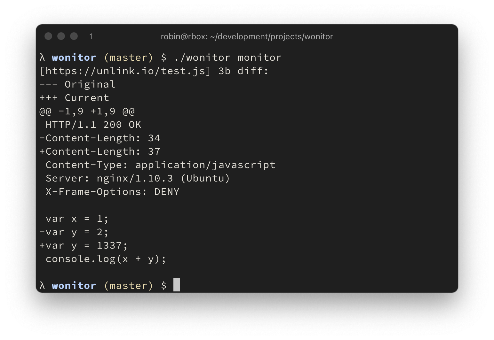

# web monitor

fast web endpoint change monitoring. for comparing responses, a selected
list of http headers and the full response body is stored on a local key/value store file. no configuration needed.

wonitor makes use of a fast file based key/value store called [BadgerDb](https://github.com/dgraph-io/badger).

To increase network throughput, a `--worker` flag allows to set the concurrency when monitoring.

endpoints returning a javascript content type will be beautified by default.



## installation

Install via go or [binary release](https://github.com/rverton/wonitor/releases):

    go get -u github.com/rverton/wonitor

## usage

```
λ $ ./wonitor
NAME:
   wonitor - web monitor

USAGE:
   wonitor [global options] command [command options] [arguments...]

COMMANDS:
   add, a      add endpoint to monitor
   delete, d   deletes an endpoint
   get, g      get endpoint body
   list, l     list all monitored endpoints and their body size in bytes
   monitor, m  retrieve all urls and compare them
   help, h     Shows a list of commands or help for one command

GLOBAL OPTIONS:
   --help, -h  show help (default: false)

λ $ ./wonitor add --url https://unlink.io/
+ https://unlink.io/
λ $ ./wonitor monitor --save
[https://unlink.io/] 1576b diff:
--- Original
+++ Current
@@ -1 +1,47 @@
+HTTP/1.1 200 OK
+Content-Type: text/html
+Server: nginx/1.10.3 (Ubuntu)
+X-Frame-Options: DENY

+<html>
+<body>
+<pre>
[... snip ...]
+</pre>
+</body>
+</html>
+

λ $ ./wonitor monitor --save
λ $ # no output because no change detected
```

## endpoint diffing

The following headers are also included in the saved response and monitored for changes:

```go
var headerToInclude = []string{
	"Host",
	"Content-Length",
	"Content-Type",
	"Location",
	"Access-Control-Allow-Origin",
	"Access-Control-Allow-Methods",
	"Access-Control-Expose-Headers",
	"Access-Control-Allow-Credentials",
	"Allow",
	"Content-Security-Policy",
	"Proxy-Authenticate",
	"Server",
	"WWW-Authenticate",
	"X-Frame-Options",
	"X-Powered-By",
}
```
